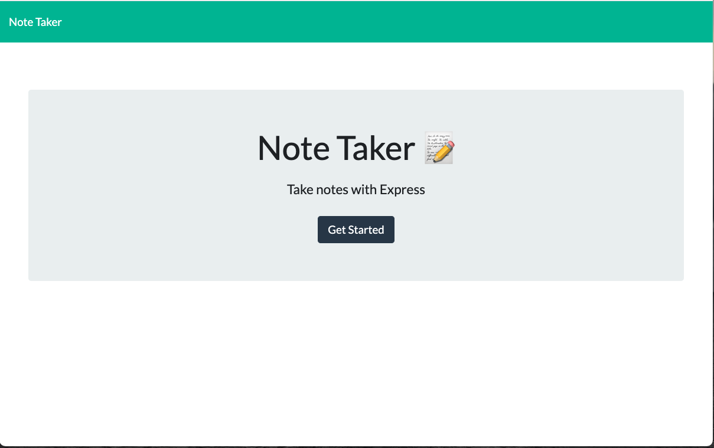
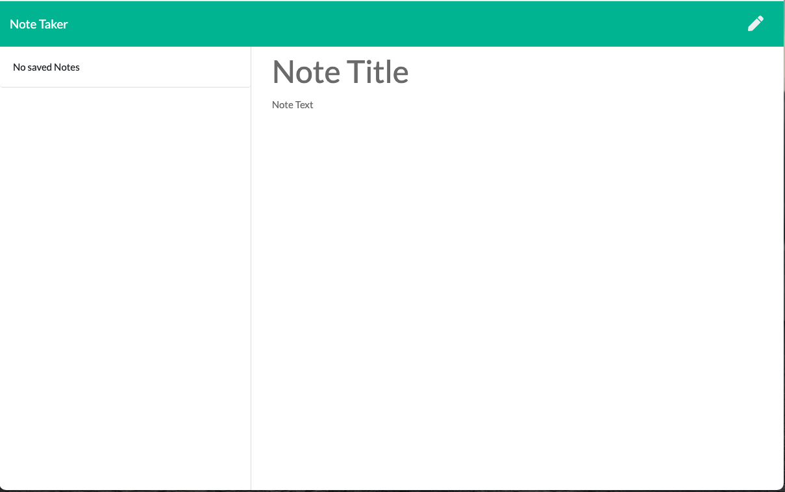
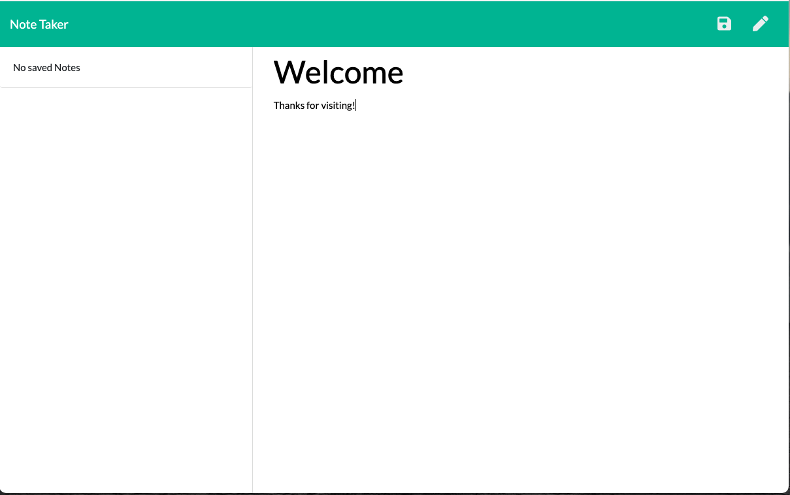
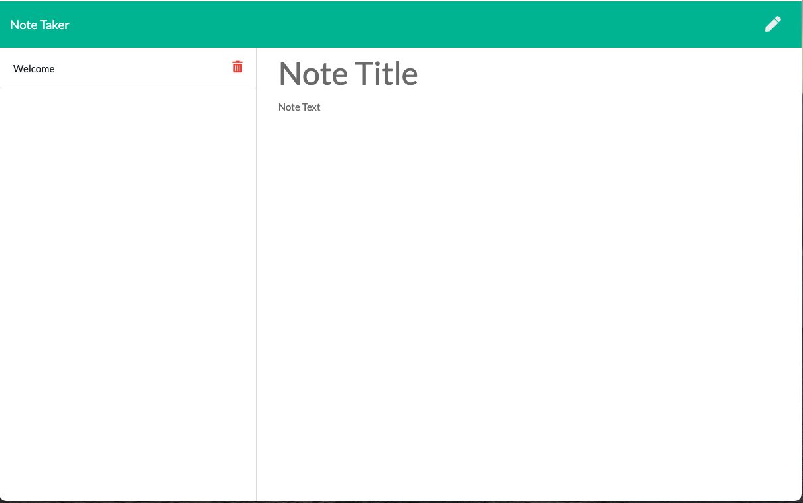

# Express-NoteTaker           
## Description
For this project I was provided some code for a website that takes notes and and saves them in a data base. problems that where solved were the program needed paths too each web page and it needed to be able to function like writing notes, saving notes, uploading to heroku, and clearing them. Some dificulties where adding the delete function.

## Deployable Link
* https://lit-forest-78156.herokuapp.com/

## Table of Contents
- [Installation](#installation)
- [Usage](#usage)
- [Credits](#credits)
- [License](#license)

## Installation
* A web browser is needed to run this code.

## Usage
* 1. Click the deployable link 2. Click get started 3. Enter a note and save it 4. Refresh the page to see all saved notes

## Credit
* 

## License 
* MIT
* <a href="https://opensource.org/licenses/MIT"> MIT License </a>

## Test
* none

## Questions
* Github: Mqt2999
* Email: Thompson.mqt@gmail.com

# Preview

